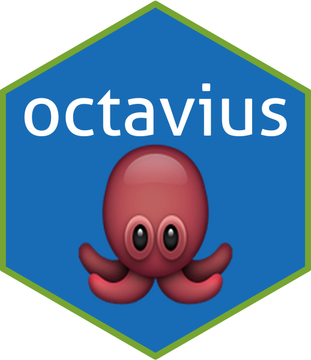

# octavius 

## A network inference and machine learning tool-kit

Facilitating network inference and machine learning workflows. Contains various functions developed over my time at GenHotel. Great for manipulating large transcriptomic data, fine tuning, and analysing machine learning results.

___

To install the package please use devtools with the following commands:

```
library(devtools)
install_github("dereckdemezquita/octavius")
```

If you are not getting updates try:

```
remove.packages("octavius")
devtools::install_github("dereckdemezquita/octavius", force = TRUE)
library("octavius")
```

## Package information

* Author: Dereck de Mézquita
* Affiliation: University Paris-Saclay
* Department: GenHotel
* Title: Computational biology; network inferencing and machine learning
* Contact: <dereck@demezquita.com>
* Website: <https://www.derecksnotes.com>


# Functions included in package

* datedName.R
* datedSave.R
* dfDeconcat.R
* dfMoveCol.R
* dfRmvNA.R
* dfRmvStr.R
* dfRound.R
* fiveCellVenn.R
* getFileWd.R
* isDefined.R
* loadRData.R
* octavius.R
* parseDot.R
* resetPar.R
* scoreDots.R
* servrKnitRhtml.R
* toBinTable.R
* topSigExtract.R
